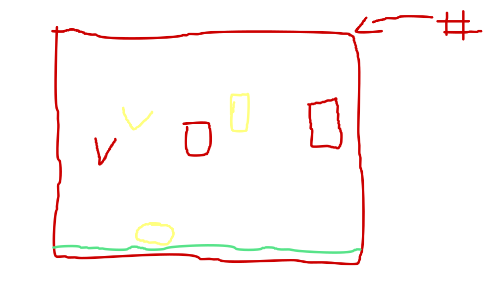

# ATRAPALOS! [Juego en ensamblador]
Un simple juego en ensamblador. Utilizando los temas vistos en la materia de Lenguajes de Interfaz.
## Reglas del Juego:
* El juego no tiene final, **¿Hasta donde crees llegar?**
* Atrapar rombo **verde**, da 10 puntos
* Atrapar un coarzón **rojo**, te quita la mitad del puntaje
* Empiezas en 0, y si vuelve a ser 0. Se acaba el juego.
* Si tienes 10, y atrapas un corazon. Se acaba el juego.
## El código, cuenta con:
* Capturas básicas de cadena. ✅
* Saltos. ✅
* Ciclos condicionales. ✅
* Incrementos y decremetos. ✅
* Procedimientos. ✅
* Interruciones. ✅
* Manejo de la pila. ✅
* Subrutinas. ✅
* Uso del bufer de audio. ✅
## Boceto inicial del juego:

## Versión final:

## Demostración del juego:

